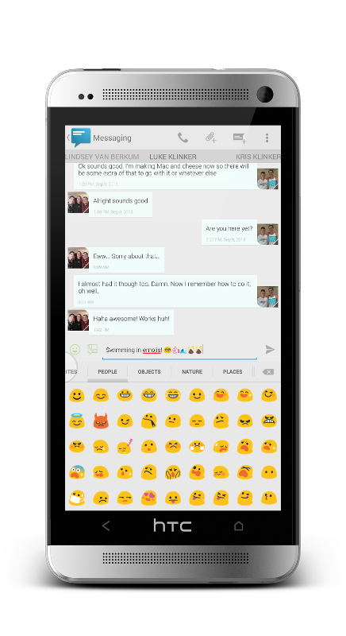

# Sliding Messaging Pro



This was the very first app that [Jake](https://github.com/klinker41) and I released together. We were freshmen in college, and didn't have too much experience with coding, but we made something very neat and successful. We wouldn't be where we are today without Sliding Messaging.

This app was originally released at the end of 2012. It has aged, and is stuck in the holo days, but it would only take the right touch to bring it up to date with material design. There isn't really any work being put into this app any longer. It has been unpublished from the Play Store, but it still works, and works pretty well!

### Building the app

Use gradle. The project can be opened in Android Studio and it will build as is.

```
$ ./gradlew build
```

All the dependencies are up to date, at the time of open-sourcing this project. I will periodically go through and continue to keep them up to date.

### What can you use it for?

Basically anything. There are cool things in here, some advanced `ViewPager` stuff with memory and keeping things up to date. Lots of different features and settings, some cool, some quirky. Overall, the app still works pretty well. It was one of the first of it's kind: ultimate customization and a focus on design.

Some neat things:
- Theme engine (might get around to open sourcing that seperate theme engine app too)
- Swipe between conversations
- SMS/MMS support and examples of working with the `ContentProvider`
- Tons of settings
- SlideOver (a lot like Facebook's chatheads)

If you want to bring it up to the material design era and want to release a material design version, I won't stop you, but it would be some work to integrate `AppCompat`.

## Future of the App

I am putting this out here just to show how far we have come. It isn't all good, but it is a very neat project. Remember the good-old days of Android development when I wasn't bogged down with replying to emails and could actually work :)

Pull requests and issues are welcome, I will do the best I can to support them if anyone chooses to contribute.

Anyways, enjoy the app, if you ever do anything with it, let me know, would love to see if anything comes from this project!


---

## License

    Copyright 2016 Klinker Apps, Inc

    Licensed under the Apache License, Version 2.0 (the "License");
    you may not use this file except in compliance with the License.
    You may obtain a copy of the License at

       http://www.apache.org/licenses/LICENSE-2.0

    Unless required by applicable law or agreed to in writing, software
    distributed under the License is distributed on an "AS IS" BASIS,
    WITHOUT WARRANTIES OR CONDITIONS OF ANY KIND, either express or implied.
    See the License for the specific language governing permissions and
    limitations under the License.
